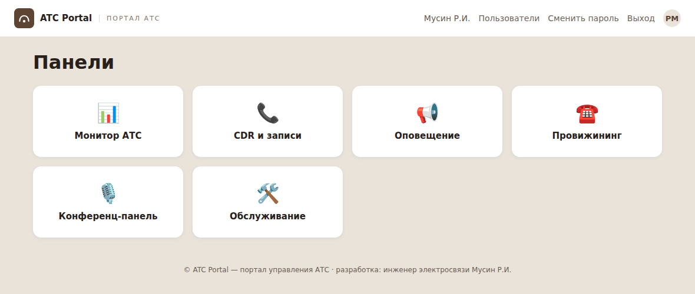
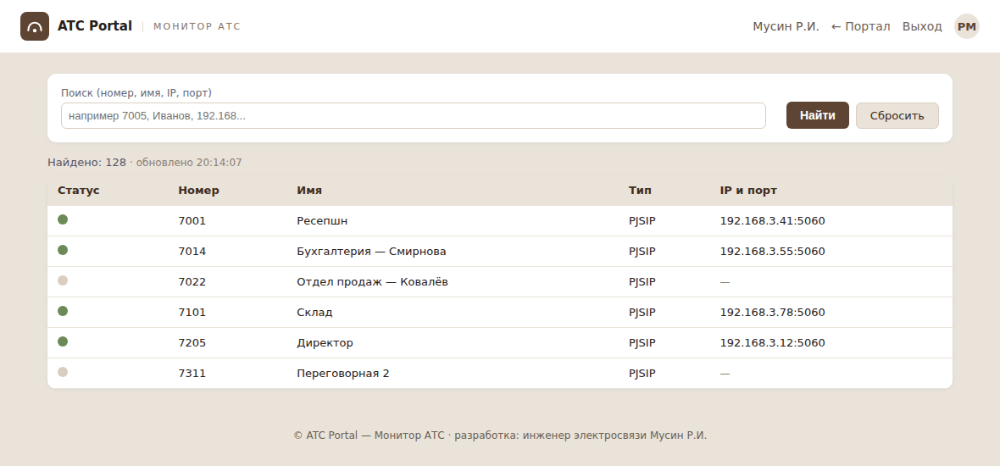
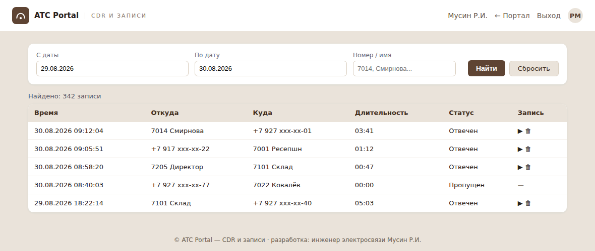
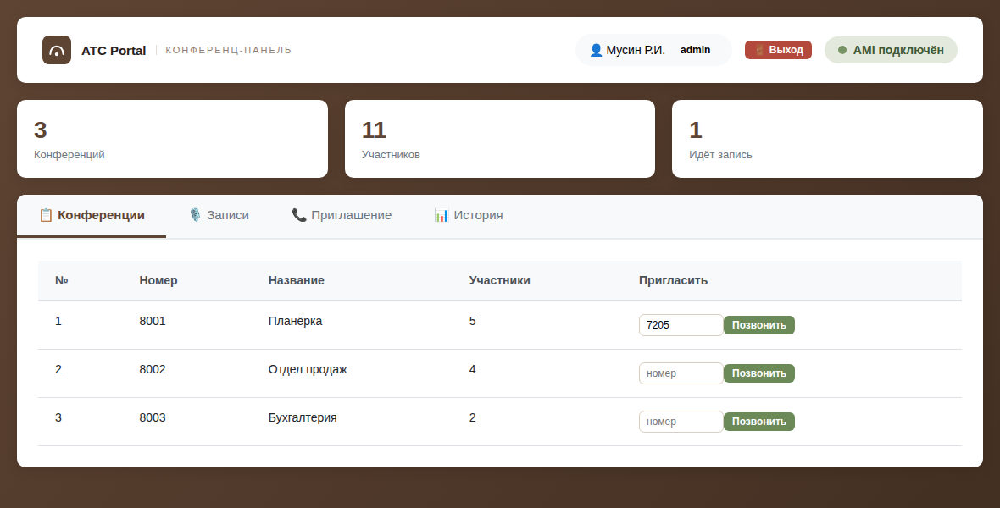
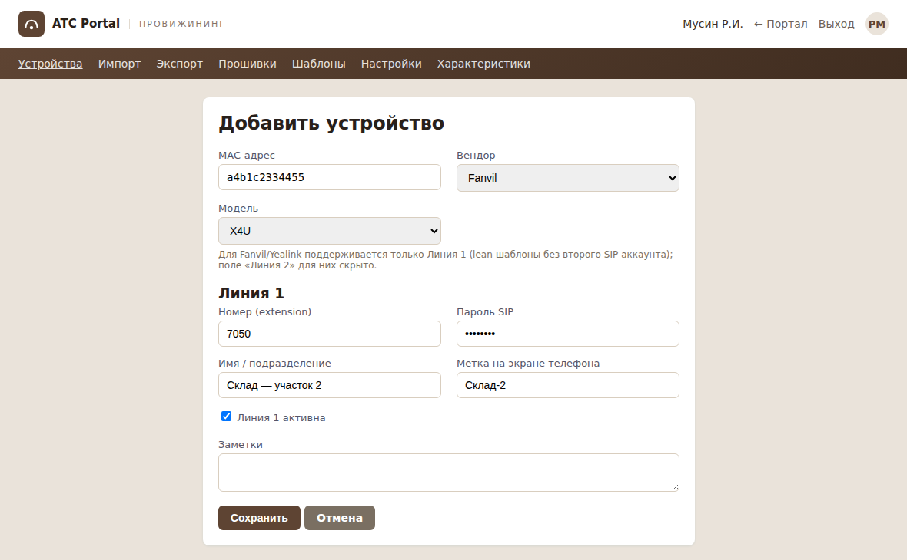
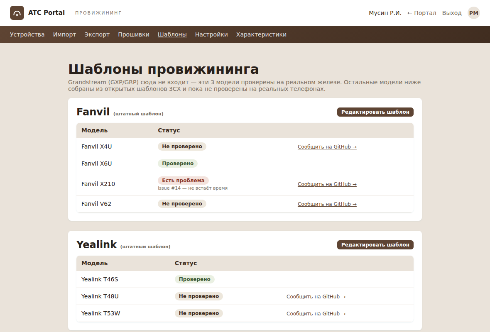

# ATC Portal — единый портал управления АТС

Открытый проект для миграции телефонии с Yeastar на Asterisk 22 / FreePBX 17.
Шесть веб-панелей управления объединены в один портал с единым входом (SSO)
и общими ролями пользователей.

Разработка: инженер электросвязи Мусин Р.И.

## Скриншоты

| Портал | Монитор АТС |
|---|---|
|  |  |

| CDR и записи | Конференц-панель |
|---|---|
|  |  |

| Добавление устройства (мульти-вендор) | Шаблоны провижининга |
|---|---|
|  |  |

## Быстрый старт

```bash
sudo ./install.sh
```

Меню:

```
1) Полная установка (портал + все 6 панелей) — для новой АТС
2) Установить/обновить только портал (SSO)
3) Установить/обновить одну панель
4) Настроить/обновить nginx (портал на порту 8888)
5) Проверить статус всех сервисов
6) Удалить всё
0) Выход
```

Для новой установки — пункт **1**. Установщик сам:
- проверит и поставит нужные системные пакеты (Python, nginx с модулем
  `auth_request`, sqlite3, rsync)
- создаст под каждый сервис отдельное виртуальное окружение Python
- создаст (или переиспользует уже существующих) AMI-пользователей в
  Asterisk для панелей, которым это нужно
- создаст read-only MySQL-пользователя для CDR-панели
- настроит systemd-юниты и nginx (включая проверку прав операторов по
  панелям — см. ниже)
- в конце выведет адрес портала и что делать дальше

Без аргументов — интерактивное меню. Также можно вызывать напрямую:

```bash
sudo ./install.sh --full        # то же самое, что пункт 1
sudo ./install.sh --status      # проверить, что всё запущено
sudo ./install.sh --nginx       # только переписать конфиг nginx
sudo ./install.sh --uninstall   # удалить всё (спросит подтверждение)
```

## Безопасный повторный запуск

Установщик можно запускать повторно (например, чтобы обновить код) — он:
- **не тронет** уже накопленные данные (базы данных, файлы секретов,
  `.env`) — обновится только код
- **не перегенерирует** уже настроенные AMI-секреты и пароль
  MySQL-пользователя CDR — они переиспользуются как есть

Это сделано так после нескольких реальных случаев за время разработки:
одна из панелей (конференц-панель) хранит AMI-секрет прямо в тексте
`api.py`, и при неосторожной полной перезаписи файла секрет однажды тихо
откатился на плейсхолдер, оборвав связь с Asterisk. Панель «Обслуживание»
умеет диагностировать и чинить такое одной кнопкой (см. ниже).

## Шесть панелей

```
nginx (порт 8888, единая точка входа)
 ├─ /             → sso-auth :8080      — портал, логин, пользователи
 ├─ /monitor/     → monitor-panel :8093 — Монитор АТС
 ├─ /cdr/         → cdr-panel :8092     — CDR / записи разговоров
 ├─ /alert/       → alert-panel :8091   — Оповещение
 ├─ /provision/   → phone-provisioning  — Провижининг (админка через
 │                   :8090 (0.0.0.0!)     портал, конфиги телефонов —
 │                                        напрямую, см. ниже)
 ├─ /confbridge/  → asterisk-panel :5000 — Конференц-панель
 └─ /maintenance/ → maintenance-panel   — Обслуживание (только для
                     :8094 (root!)        администратора)
```

Все сервисы, кроме провижининга, слушают только `127.0.0.1` — снаружи
доступны исключительно через nginx с проверкой SSO-сессии.

**Провижининг — исключение**: обязан слушать `0.0.0.0`, потому что часть
его маршрутов (`/cfg<mac>.xml`, `/firmware/...`) должна быть доступна
телефонам напрямую по всей локальной сети (через DHCP option 66, не
через портал). Веб-админка провижининга при этом всё равно защищена
SSO — панель доверяет заголовку от портала только если запрос пришёл с
`127.0.0.1` (то есть реально через nginx), а не подделан напрямую с
любого LAN-адреса.

**Обслуживание — тоже особый случай**: единственная панель, работающая
от `root` (не от `www-data`, как остальные пять) — ей нужны права
перезапускать через `systemctl` остальные службы, читать `journalctl`
и вносить правки в AMI-конфигурацию Asterisk при ротации секретов.
Доступ к ней — только у роли «Администратор», без исключений.

## Права доступа операторов по конкретным панелям

На странице «Пользователи» у роли «Оператор» отмечается чекбоксами,
какие именно панели ему доступны — по умолчанию все, кроме
«Обслуживание» (она в принципе только для администратора).

Ограничение проверяется **не только в интерфейсе, но и на сервере**:
nginx передаёт порталу заголовок с тем, к какой панели идёт запрос,
портал сверяет его со списком разрешённых панелей пользователя и
отдаёт `403`, если панель не входит в список. Значит прямой переход по
URL в обход портала тоже заблокирован, не только скрытая карточка на
главной странице. Администраторы видят и могут заходить абсолютно всюду
независимо от этого списка.

## Панель «Обслуживание»

Шестая панель, добавленная специально для эксплуатации всего
остального:

- **Статус всех сервисов** — все 6 + nginx, индикаторы вкл/выкл, кнопка
  «Перезапустить» у каждой (кроме себя самой — не даст перезапустить
  панель обслуживания из её же интерфейса)
- **AMI-консоль** — отправка сырых команд в Asterisk прямо из браузера,
  с кнопками быстрого доступа к частым командам
- **Логи** — просмотр `journalctl` любого из 6 сервисов без захода по SSH
- **AMI-секреты** — единый список всех AMI-пользователей проекта с
  индикатором расхождения (когда в Asterisk и в самой панели разные
  секреты — типичная причина "панель не подключена к AMI"), и кнопка
  ротации, которая обновляет секрет сразу везде и перезапускает нужную
  службу
- **Место на диске** — сколько занимают записи разговоров, с
  возможностью почистить старше N дней (звуки оповещений сюда
  сознательно не входят — это не расходуемые данные, их нельзя удалять
  автоматически)
- **Резервное копирование** — скачать/восстановить архив с базами
  пользователей и панелей, конфигом nginx и AMI-конфигурацией
  Asterisk одной кнопкой. При восстановлении архив проверяется целиком
  (защита от подмены файлов), старые версии сохраняются рядом с
  суффиксом `.before-restore`. В HA-кластере восстановление на backup-узле
  блокируется по умолчанию (см. `docs/alerts-notifications.md`)
- **fail2ban — исключения (ignoreip)** — управление списком адресов/подсетей,
  которые не должны попадать под автоматическую блокировку (например IP
  смежной АТС или шлюза, с которым у вас транк) — прямо из браузера,
  с синхронизацией на соседний узел HA-кластера

## Уведомления об ошибках

Колокольчик 🔔 в шапке портала (виден только администраторам) — статус
сервисов, AMI, диска и HA-кластера, с ручным снятием и объединением
уведомлений с обоих узлов HA. Подробности — `docs/alerts-notifications.md`.

## Поддерживаемые модели телефонов (провижининг)

**Grandstream** — проверено на реальном железе, стабильно работает:

- **GXP1610 / GXP1615 / GXP1620 / GXP1625**
- **GXP2170**
- **GRP2613 / GRP2613W / GRP2615 / GRP2636 / GRP2650**
  (старое название той же линейки — GXP2613 / GXP2615 / GXP2636 / GXP2650;
  Grandstream переименовал модели, панель распознаёт оба варианта как
  один и тот же телефон)

**Fanvil** (54 модели, серии X/V/W) и **Yealink** (34 модели, T19–T57) —
добавлены недавно, шаблоны собраны из официальных конфигов 3CX и **пока
не проверены на реальных телефонах**. Полный список моделей и их текущий
статус — на вкладке «Шаблоны» в панели провижининга.

Если у вас есть один из этих телефонов — буду благодарен за проверку и
отчёт, см. «Обратная связь» ниже. Другие производители (Cisco, Polycom
и т.п.) пока не поддерживаются вообще.

## Оформление

Портал и все шесть панелей оформлены в едином стиле: логотип на
светлой полосе в шапке каждой страницы, единая палитра, единый размер
кнопок, единая структура навигации.

## Первый вход

1. `http://<IP-сервера>:8888/setup` — создать первого администратора
2. Дальше пользователей — на странице «Пользователи» в самом портале

Если на сервере уже стояли старые панели с локальными логинами и нужно
перенести их в SSO — **до** первого `/setup`:

```bash
cd /opt/sso-auth
sudo ./venv/bin/python migrate_users.py --dry-run   # посмотреть, что перенесётся
sudo ./venv/bin/python migrate_users.py             # выполнить
```

## Структура пакета

```
install.sh              — главный скрипт с меню
LICENSE                  — MIT
.gitignore                — исключает секреты/БД/venv из репозитория
lib/
  common.sh                — общие функции (логи, проверки, генерация секретов)
  dependencies.sh           — проверка/установка системных пакетов
  freepbx.sh                 — чтение креденшлов БД из /etc/freepbx.conf
  mysql.sh                    — создание read-only пользователя для CDR
  ami.sh                       — создание/переиспользование AMI-пользователей
  panel_common.sh                — общие шаги установки сервиса (venv, systemd-юнит)
  services.sh                     — по функции install_<сервис>() на каждую панель
nginx/
  setup.sh                         — генерация конфига портала (все 6 панелей)
services/
  sso-auth/                         — портал: вход, пользователи, права по панелям
  monitor-panel/                     — Монитор АТС
  cdr-panel/                          — CDR-панель
  alert-panel/                         — панель оповещения
  phone-provisioning/                   — провижининг телефонов
  confbridge-panel/                      — конференц-панель
  maintenance-panel/                      — панель обслуживания
```

## Обратная связь

Проект пока обкатан только на одной инсталляции. Буду рад багрепортам
и предложениям по новым функциям — через Issues в этом репозитории.

**Отдельно нужна помощь с проверкой Fanvil/Yealink** (88 моделей,
собраны из чужих шаблонов, вживую не тестировались) — если провижинили
такой телефон через панель, отпишитесь в
[Discussions](../../discussions) (что сработало / что нет, модель,
прошивка) или прямо в Issues кнопкой «Сообщить на GitHub» на вкладке
«Шаблоны». Один рабочий отчёт по модели — и статус меняется на
«Проверено».
